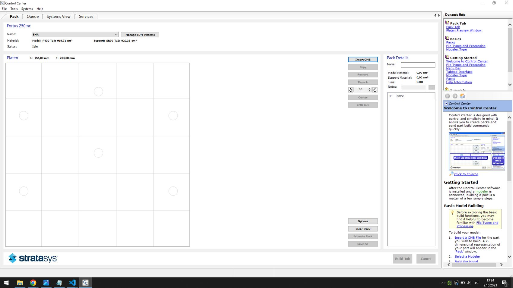
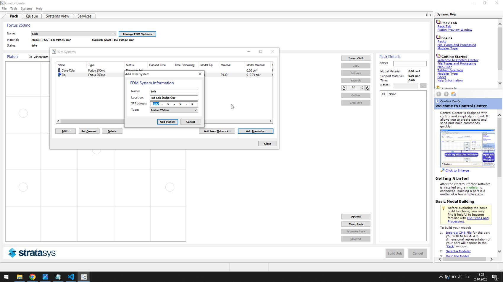

# How to use the Dimension 1200SST 3D printers

## Set up the software

Set up the [Stratasys Insight](files/InsightTo114-64Test-off.exe) software.

## Connect to the printer

You need to plug the printer into power to turn it on. It takes a moment to turn on and heat up. To connect to the printer and send print jobs, you need to connect the printer with a LAN cable to a router, and your computer needs to be connected to the same router.

To connect to the printer, first go into the menu on the LCD screen on the printer itself: Go into Maintenance -> System -> Set Network. You can select either Static IP or Dynamic IP. Dynamic IP worked for me. I selected that and noted the 3D printer's IP address.

Then you open Control Center to connect to the printer (it came with the Insight software installation).

*Stratasys Control Center*

To connect to the printer, select the Manage FDM Systems button near the top.

*In the FDM Systems window, select Add Manually...*

*Here you input the IP address of the printer and you can also give it a name. Select Fortus 250mc in the dropdown menu at the bottom.*

Now your printer should appear in the list of FDM Systems.

## Slice an STL model

Open the Insight software.

The printer has been [modified](https://www.reddit.com/r/3Dprinting/comments/atwlq6/stratasys_insight_and_dimension_1200_sst/) to operate exactly like a Fortus 250 printer. So you set the printer as Fortus 250 when you first open up the software. Stratasys limits the layer heights that you can use, as well as the build volume of the printer.