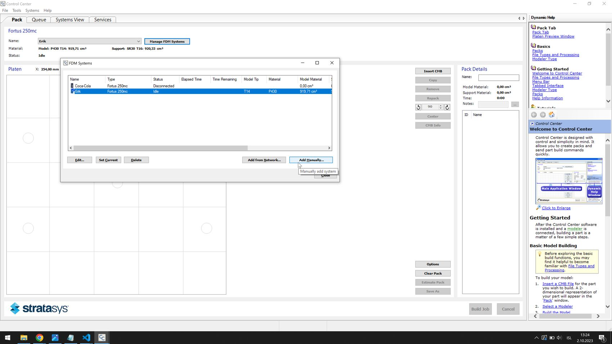

# How to use the Dimension 1200SST 3D printers

## Set up the software

Set up the [Stratasys Insight](files/InsightTo114-64Test-off.exe) software.

## Connect to the printer

You need to plug the printer into power to turn it on. It takes a moment to turn on and heat up. To connect to the printer and send print jobs, you need to connect the printer with a LAN cable to a router, and your computer needs to be connected to the same router.

To connect to the printer, first go into the menu on the LCD screen on the printer itself: Go into Maintenance -> System -> Set Network. You can select either Static IP or Dynamic IP. Dynamic IP worked for me. I selected that and noted the 3D printer's IP address.

Then you open Control Center to connect to the printer (it came with the Insight software installation).

*Stratasys Control Center*

To connect to the printer, select the Manage FDM Systems button near the top.

*In the FDM Systems window, select Add Manually...*

*Here you input the IP address of the printer and you can also give it a name. Select Fortus 250mc in the dropdown menu at the bottom.*

Now your printer should appear in the list of FDM Systems.

## Load material

The modeling material (ABS) goes in the top tray and the support material (HIPS or SR-30) goes in the bottom tray. Let's go through how to load modeling material into the printer.

The printers have a self-load feature which you can access from the main menu by going into Material. This takes a long time. It's much quicker to do it manually.

Go into Maintenance -> Machine. Then you need to wait while the printer calibrates itself and warms up. Once it's warm you get another menu. Go into Head. The head will warm up to melting temperature. Once the head is hot you can choose which side you want to work on. Choose Model material. Then select Forward. The wheel in the printhead starts turning. You load the filament through the little hole inside the cartridge in the top bay in the printer (the one marked with 'M'). Then you need to push the filament into the printer, all the way up to the printhead, where it engages with the wheel and starts extruding through the tip.

Press Stop, then choose the Support side. Do the same thing with the HIPS material in the bottom bay (the one marked 'S').

## Print test part

Go to Maintenance -> System -> Test parts and choose a test part to print.
## Slice an STL model

Open the Insight software. 

Select the icon that looks like the 3D printer.

The printer has been [modified](https://www.reddit.com/r/3Dprinting/comments/atwlq6/stratasys_insight_and_dimension_1200_sst/) to operate exactly like a Fortus 250 printer. So you configure the printer as Fortus 250.

Here's a  [basic tutorial](https://www.youtube.com/watch?v=jisB9HIgxOc) on how to process parts in Insight.

[Here's a tip](https://www.youtube.com/watch?v=HfuPfBoaE1U) on modifying supports in Insight. There are more Insight tutorial videos on the same Youtube channel.

## Upgrade print options in Insight

Download and extract [kapaa.zip](files/kapaa.zip).

Go to C:\Program Files\Stratasys\Insight 11.4\modelers and rename the kapaa folder to kapaa_old. Copy the extracted kapaa folder to the location.

The next time you open Insight you should have more layer height options.

If you open Control Center you should also see a larger build volume.

## Reset the cartridge chips
When the printer says that your model or support cartridge is empty, it ejects the cartridge. Then you need to grab an Arduino and one 2.2kOhm resistor and follow [this tutorial](https://www.youtube.com/watch?v=M94D-Pot6c8) to 'refill' the cartridge with material.

## Further instructions

You'll can find the manuals in the [files](files) folder.

## Specifications

- The SST 1200es uses Soluble Support Technology in which the supports are dissolved after printing in a solution
- Dimension SST 1200es: $32,900*
- Model material:
ABSplus in ivory, white, black, red, olive green, nectarine, fluorescent yellow, blue or gray.
- Support material:
Soluble Support Technology (SST)
- Build Size:
254 x 254 x 305 mm (10 x 10 x 12 inches)
- Layer Thickness:
.254 mm (.010 in.) or .33 mm. (.013 in.) of precisely deposited ABSplus model and support material.
- Workstation Compatibility:
Windows® XP / Windows Vista® / Windows® 7
- Network Connectivity:
Ethernet TCP/IP 10/100Base-T
- Size and Weight:
838 x 737 x 1143 mm (33 x 29 x 45 in.)
148 kg (326 lbs.)
- Power Requirements:
110-120 VAC, 60 Hz, minimum15A dedicated circuit;
or 220-240 VAC, 50/60 Hz, minimum 7A dedicated circuit
- Regulatory Compliance:
CE / ETL